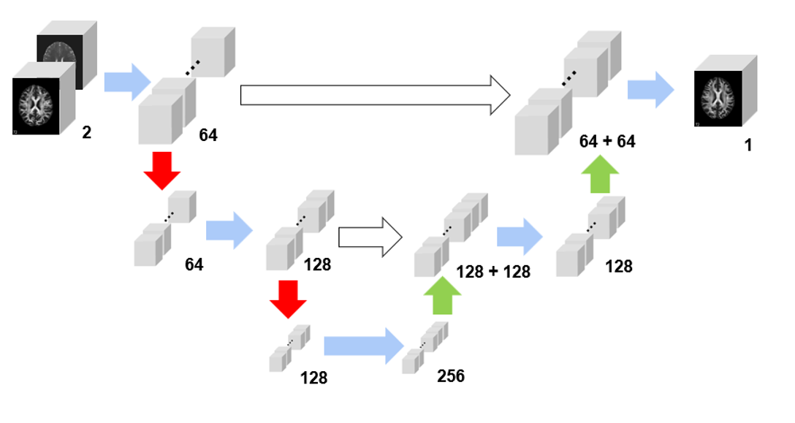

# FA-ADC-SYNTHESIZE
This is a 3D convolution U-Net to synthesize MRI FA and ADC phases. It can also work as a generator of condition GAN. This project wins the highest rank in [Prof. Prince](https://engineering.jhu.edu/faculty/jerry-prince/)'s Midical Image Analysis lecture in spring 2023.

# Abstract
This project aims to synthesize Fractional Anisotropy (FA) and Apparent Diffusion Coefficient (ADC) maps from T1-weighted (T1w) and T2-weighted (T2w) magnetic resonance imaging (MRI) images. These maps provide crucial information about various tissue properties, some of which are not readily available during the MRI scanning process. To achieve this objective, we will utilize learning-based methods to extract the brain region, align the multi-slice images, and perform pixel-wise synthesis. Additionally, we will explore various optimization strategies, develop state-of-the-art neural networks, and establish balanced evaluation criteria. The effectiveness of the proposed approach will be evaluated comprehensively.

# Architecture
{: width="30"}

# Prerequisite
## Dataset
The [raw dataset](https://livejohnshopkins-my.sharepoint.com/personal/zbian4_jh_edu/_layouts/15/onedrive.aspx?id=%2Fpersonal%2Fzbian4%5Fjh%5Fedu%2FDocuments%2FMedIA%5FProject2&ga=1) of 200 subjects are available, each containing four different types (T1w, T2w, FA, ADC) of MRI images.

We employ a pre-trained [HD-BET model](https://www.ncbi.nlm.nih.gov/pmc/articles/PMC6865732/) to extract the brain region by removing the skull. Subsequently, we utilize the registration function of the [ANTsPy library](https://antspy.readthedocs.io/en/latest/registration.html) to align the images to the T1w reference. 

## Environment
Python 3.9.16 
PyTorch 2.0.0 
NiBabel 5.1.0 
NumPy 1.24.3 
Matplotlib 3.7.1 
tqdm 4.65.0